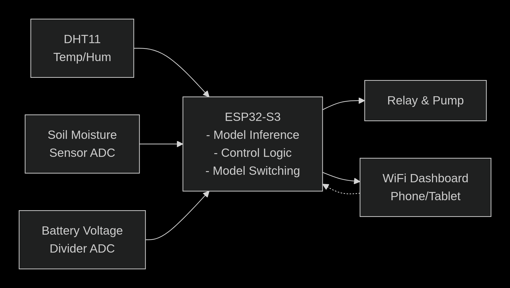
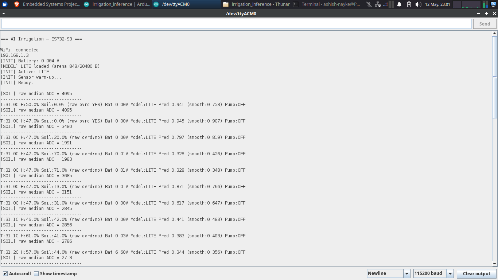

# Power‑Adaptive Smart Irrigation System with TinyML

A battery‑adaptive, AI‑driven irrigation controller running on an ESP32‑S3 microcontroller.  
It uses two quantised TensorFlow Lite models (Lite / Full) dynamically switched based on battery voltage, and a hybrid dead‑band + AI hysteresis control logic to maintain soil moisture within a target range.

**Demo video:** [link to your YouTube video]  
**Live dashboard:** accessible via WiFi on any phone (see below).

---

## Features
- **Two INT8 quantised models** – Lite (8‑neuron, ~2.4 KB) and Full (113‑param, ~3.1 KB)
- **Battery‑adaptive model switching** – automatically downgrades to Lite when battery is low
- **Hybrid control logic** – raw‑ADC hard override + target moisture dead‑band + AI hysteresis
- **Robust sensor handling** – DHT11 with retry, soil moisture median filter, fault detection
- **Safety** – maximum irrigation watchdog, minimum pump off‑time, sensor failure fail‑safe
- **Lightweight WiFi dashboard** – real‑time monitoring without an internet connection
- **Reproducible pipeline** – dataset generation, training, INT8 quantisation, header export

---

## Hardware
| Component           | Details                           |
|---------------------|-----------------------------------|
| Microcontroller     | ESP32‑S3 WROOM‑1 N16R8           |
| Temperature/Humidity| DHT11 (can be upgraded)           |
| Soil moisture       | Resistive probe, ADC              |
| Relay               | 5 V module (active LOW)            |
| Pump                | Mini DC 3‑6 V                     |
| Battery             | 2S Li‑ion pack (7.4 V nominal)     |
| Power for ESP       | USB power bank (separate)         |

**Pin mapping:**
| Signal        | GPIO |
|---------------|------|
| Relay         | 6    |
| Status LED    | 38   |
| Battery ADC   | 7    |
| Soil ADC      | 5    |
| DHT11 DATA    | 4    |

A simple voltage divider (2×10 kΩ) measures the battery.

---

## System Architecture

 <!--*(optional – add a diagram)*-->

### Decision Logic (Priority Order)
1. **Raw‑ADC hard override** – if the soil sensor raw value exceeds a threshold → irrigate immediately.
2. **Dead‑band controller** – if soil moisture is below `TARGET_SOIL_LOW` (30%) → force ON; above `TARGET_SOIL_HIGH` (60%) → force OFF.
3. **AI hysteresis** – inside the bracket, the smoothed model probability decides:
   - `smoothedProb > 0.55` → Pump ON
   - `smoothedProb < 0.35` → Pump OFF
   - Otherwise hold current state

### Model Switching
Battery voltage is measured, EMA‑filtered, and compared against a threshold (3.5 V).  
Hysteresis (±0.05 V) and single‑step transitions prevent oscillation.

---

## Machine Learning Pipeline

**1. Dataset generation (`01_generate_dataset.py`)**  
- 4500 synthetic samples with realistic noise  
- Soft labels derived from the rule: `soil < 30 OR (temp > 35 AND humidity < 40)`  
- 70/15/15 train/val/test split, calibration grid for quantisation  

**2. Training (`02_train_models.py`)**  
- Two architectures: Lite (8→1) and Full (8→8→1)  
- Class weights for imbalance, EarlyStopping on val loss  
- Hard‑rule accuracy: Lite ≈ 91%, Full ≈ 95%  

**3. Quantisation (`03_quantize_convert.py`)**  
- Full INT8 quantisation with float32 I/O  
- Calibration grid ensures full input coverage  
- Post‑quant accuracy verified against hard rules  

**4. Header export (`04_convert_to_header.py`)**  
- Model arrays placed in Flash (PROGMEM) with 16‑byte alignment  

---

## Results & Runtime Logs

The system was tested in two scenarios: normal operation (3 min pump rest) and quick testing (1 min).  
The logs are in `logs/`.  
- Stable irrigation control: pump turns ON when soil dries, OFF when it reaches the target band  
- Model switching demonstrated (Lite ↔ Full)  
- No false triggers, no oscillations  

 <!--*(optional screenshot)*-->

---

## How to Reproduce

**1. Clone the repository**  
```bash
git clone https://github.com/AshishNayke01/smart-irrigation-tinyML.git
